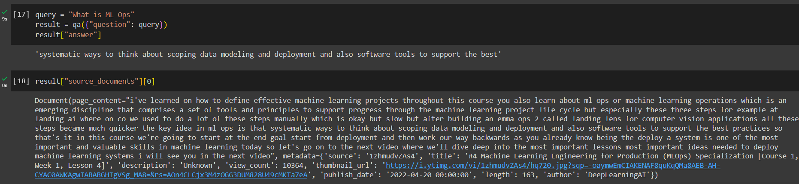

# YouTubeSearch

Using the [Machine Learning Engineering for Produciton (MLOps)](https://www.youtube.com/watch?v=NgWujOrCZFo&list=PLkDaE6sCZn6GMoA0wbpJLi3t34Gd8l0aK) playlist from the channel [DeepLearning.AI](https://www.youtube.com/@Deeplearningai), instructed by Andrew Ng.

Create a chatbot that allows the user to search for specific questions about the topics covered in the video without trying to search for any description or specific time stamp to watch the video again.

The chatbot is created using LangChain framework which uses [google/flan-t5-large](https://huggingface.co/google/flan-t5-large) LLM and [sentence-transformers/all-MiniLM-L6-v2](https://huggingface.co/sentence-transformers/all-MiniLM-L6-v2) embeddings model from Hugging Face, and Qdrant vector store.

The notebook with chatbot created is located at `"./src/notebooks/YouTubeSearch.ipynb"`

### Run:

Change the value of "query" variable to get answer. The source of the answer is also returned by the conversation chain.

### Screenshot

### Future work

The current project carries no-cost, but can be integrated with OpenAI GPT 3.5 turbo to have much better interpretation of questions and well formed answers. The chatbot can be hosted on Hugging Face Hub or a server along with a UI for better experience. The vector store can be further extended with ability to add more youtube video links.